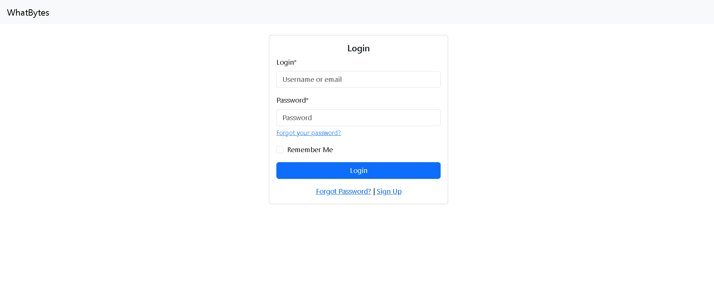

# WhatBytes Project

## Overview
The WhatBites project is a Django-based web application that provides user authentication and profile management features. It uses the Django Allauth library for user authentication, along with Django Crispy Forms and Bootstrap 5 for responsive and clean UI.

## Features
- User registration and login with username/email and password.
- Password reset functionality with email notifications.
- Change password and signout confirmation views.
- Responsive design using Bootstrap 5.
- Alert messages for user feedback.

## Login Page


## Installation
1. Clone the repository:
   ```bash
   git clone https://github.com/sumeryadav/byte_auth
   cd whatbites_project
   ```
2. Set up a virtual environment:
   ```bash
   python -m venv venv
   source venv/bin/activate  # On Windows: venv\Scripts\activate
   ```
3. Install dependencies:
   ```bash
   pip install -r requirements.txt
   ```
4. Apply migrations:
   ```bash
   python manage.py migrate
   ```
5. Run the development server:
   ```bash
   python manage.py runserver
   ```

## Usage
1. Access the application in your browser at `http://127.0.0.1:8000/`.
2. Use the signup page to create a new account or login with an existing account.
3. Reset your password using the "Forgot Password" feature if needed.
4. Change your password or view your profile after logging in.

## Technologies Used
- Django: Backend framework
- Django Allauth: User authentication
- Django Crispy Forms: Form rendering
- Bootstrap 5: Frontend framework for responsive design

## Notes
- The email backend is configured to log emails to the console for testing purposes.
- Update the `EMAIL_BACKEND` setting for production to enable real email functionality.

